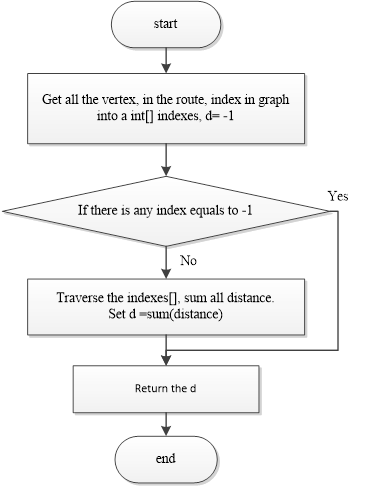

This project mainly supplies some methods to compute routes between two given vertexes

1.Vertex
This class is to describe the point in graph, it has 2 members, index and value, and the value can be any type of an object.

2.Edge
Maily for describing a route with a start point, an ending point, and the distance.

3.Graph
The graph stores the key value of vertex, the index in vertex maps to the index of vertex in vertex list, 
and the distance between vertex, the row and colum index maps to index of vertex in vertex list.

4.GraphAlgorithm
It offers two kinds of algorithms, one is to compute the shortest distance between two points, another is to compute the numbers of routes between points.

- dijkstra

- routesNum

- routesNumLimit

- computeDistance

5.RouteOfString
This class mainly describes a route, which has a graph in. The mainly works here is to init a graph describing train routes.
- CreateGraph
- initEdges

6.Demo
Here is the demo, containing 10 outputs for the shortest distance and how many the routes is between points.

7.How to use
The graph pakage is composed of the route algorithm and the graph model, the value in the vertex could be anything.

e.g.

    List<String> list = readEdgeFromTxt(txtPath);
    Route route = new RouteOfString(list);
    double d = GraphAlgorithm.computeDistance(this.route.getGraph(), indexs);

